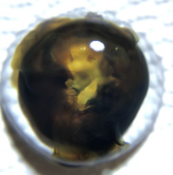

# L'illustration 2023 {-}

L'illustration utilisée en couverture de l'édition de cette brochure est la photo gagnante d'un concours de macro-photographie organisé dans le cadre des laboraroires de chimie de la classe 2M21 pendant l'année scolaire 2021-2022.

Nos félicitations et nos remerciements vont aux auteurs de cette image : Élise Rollier et Yann Lopez (3M21).